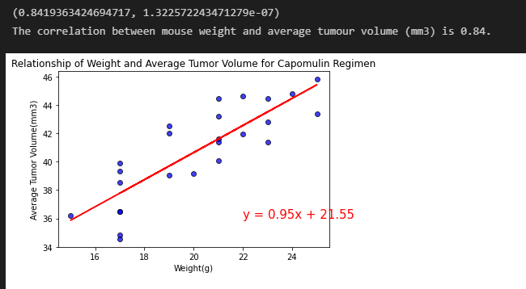

# Matplotlib-Challenge

## Background - Matplotlib

What good is data without a good plot to tell the story?

So, let's take what you've learned about Python Matplotlib and apply it to a real-world situation and dataset:

While your data companions rushed off to jobs in finance and government, you remained adamant that science was the way for you. Staying true to your mission, you've joined Pymaceuticals Inc., a burgeoning pharmaceutical company based out of San Diego. Pymaceuticals specializes in anti-cancer pharmaceuticals. In its most recent efforts, it began screening for potential treatments for squamous cell carcinoma (SCC), a commonly occurring form of skin cancer.

As a senior data analyst at the company, you've been given access to the complete data from their most recent animal study. In this study, 249 mice identified with SCC tumor growth were treated through a variety of drug regimens. Over the course of 45 days, tumor development was observed and measured. The purpose of this study was to compare the performance of Pymaceuticals' drug of interest, Capomulin, versus the other treatment regimens. You have been tasked by the executive team to generate all of the tables and figures needed for the technical report of the study. The executive team also has asked for a top-level summary of the study results.

## Instructions

Your tasks are to do the following:

* Before beginning the analysis, check the data for any mouse ID with duplicate time points and remove any data associated with that mouse ID.

* Use the cleaned data for the remaining steps.

* Generate a summary statistics table consisting of the mean, median, variance, standard deviation, and SEM of the tumor volume for each drug regimen.

* Generate a bar plot using both Pandas's `DataFrame.plot()` and Matplotlib's `pyplot` that shows  the number of total mice for each treatment regimen throughout the course of the study.

  * **NOTE:** These plots should look identical.

* Generate a pie plot using both Pandas's `DataFrame.plot()` and Matplotlib's `pyplot` that shows the distribution of female or male mice in the study.

  * **NOTE:** These plots should look identical.

* Calculate the final tumor volume of each mouse across four of the most promising treatment regimens: Capomulin, Ramicane, Infubinol, and Ceftamin. Calculate the quartiles and IQR and quantitatively determine if there are any potential outliers across all four treatment regimens.

* Using Matplotlib, generate a box and whisker plot of the final tumor volume for all four treatment regimens and highlight any potential outliers in the plot by changing their color and style.

* Select a mouse that was treated with Capomulin and generate a line plot of tumor volume vs. time point for that mouse.

* Generate a scatter plot of mouse weight versus average tumor volume for the Capomulin treatment regimen.

* Calculate the correlation coefficient and linear regression model between mouse weight and average tumor volume for the Capomulin treatment. Plot the linear regression model on top of the previous scatter plot.

* Look across all previously generated figures and tables and write at least three observations or inferences that can be made from the data. Include these observations at the top of notebook.

# Observations and Insights

## Quartiles, Outlier and Boxplots Analysis

When summarising final tumour volumes, as shown in the box plot graph below, out of the main four drug regimens only Capomulin and Ramicane managed to reduce tumor volume over time. Their average final tumour volumes were approximately 38 to 39mm3, when initial tumour volumes were 45mm3 large. Interestingly mouses treated with Infubinol had no tumour sizes decrease over the time period barring one. Shown to have a finishing tumour volume of roughly 35mm3 and is seen to be the only potential outlier out of all mouses within the main four regimens tested.

## Line Plots Analysis

When looking at the outputted line plot below of Capomulin treated mouse "l509", the tumour growth seems steadily grow for the initial half of the allocated time period of 20 days peaking at 48mm3. 3mm3 above the initial size. But then finally declines quickly dropping to a minimum size of 40mm3 after 35 days. This period of steadily inclination before the downswing could indicate the time it takes for Capomulin to take effect on tumour volume. After the 35 day period however the tumour does resume to grow steadily again. Potentially indicating after around 35 days the effect of Capomulin on tumour size wears off.

## Scatterplots, Correlation and Linear Regression Analysis

By interpreting the scatterplot and line of best fit in the graph at the bottom, there seems to be a strong positive linear correlation between size of the mouse and average tumour volume over the couse of the treatment period. Positing a correlation coefficent of 0.84. The larger the mouse, the higher the expected tumour volume will be over every point in time.

# Example Output 

## Look in pymaceuticals_starter.ipynb to see all outputs